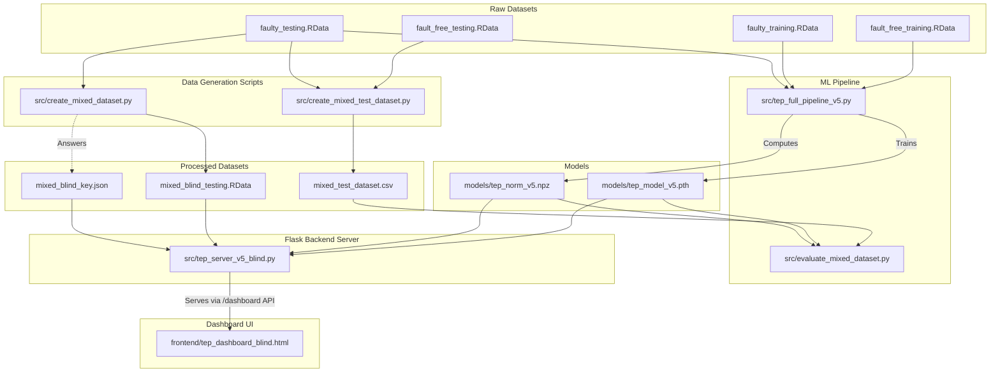

# TEP Data Simulation Project
## Multi-Class Fault Classifier & Blind Testing Backend

This project provides a complete machine learning pipeline and API backend for the Tennessee Eastman Process (TEP) anomaly detection benchmark. It focuses on taking raw simulation data, training a PyTorch LSTM model, and providing a robust backend server designed for real-time monitoring and blind evaluation.

## Architecture Flowchart

## Directory Structure
- `data/raw/`: Place your large Harvard Dataverse `.RData` datasets here.
- `data/processed/`: Generated mixed datasets and answer keys are saved here.
- `src/`: Core Python scripts.
- `models/`: The PyTorch trained weights (`.pth`) and normalization parameters (`.npz`).
- `frontend/`: Static dashboard HTML.
- `outputs/`: Reports and model training curve images.

## Scripts Overview

### 1. `src/tep_full_pipeline_v5.py`
The core machine learning pipeline. It builds a Two-layer LSTM → 21-way softmax classifier to identify 20 different faulty behaviors.
- **Run:** `python src/tep_full_pipeline_v5.py`
- *Set `LOAD_PRETRAINED = False` in the script if you wish to train from scratch instead of evaluating.*

### 2. `src/create_mixed_dataset.py`
Creates a blind testing dataset consisting of 40 runs with completely shuffled run numbers. The answer key is hidden and maintained separately for evaluating the model objectively.
- **Run:** `python src/create_mixed_dataset.py`

### 3. `src/create_mixed_test_dataset.py`
The original testing dataset introduces faults strictly at `t=160`. This script mixes normal and faulty data to introduce faults at varying timeframes, making sure the model evaluates the actual signal and not just timestamps.
- **Run:** `python src/create_mixed_test_dataset.py`

### 4. `src/evaluate_mixed_dataset.py`
Validates the trained model against the mixed-timing dataset generated above.
- **Run:** `python src/evaluate_mixed_dataset.py`

### 5. `src/tep_server_v5_blind.py`
The Flask-based API backend. It acts as a live monitor handling real-time inference requests. It uses dual-detector Statistical Process Control (SPC) thresholds to keep False Alarms Rates (FAR) at zero while identifying abnormalities.
- **Run:** `python src/tep_server_v5_blind.py`
- The backend serves the dashboard at `http://127.0.0.1:5000/dashboard`.
