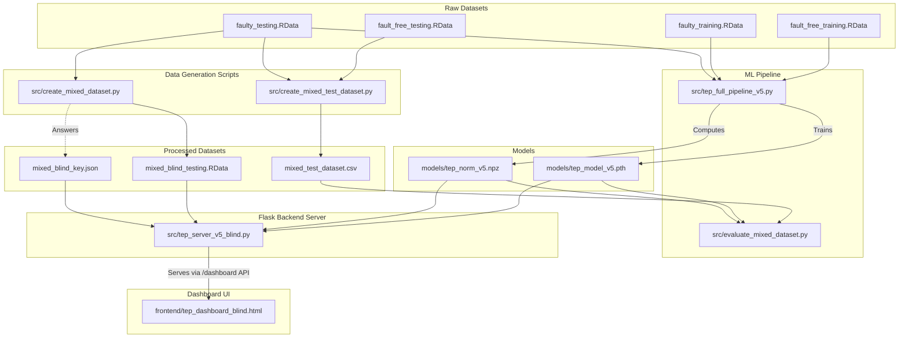

# TEP Data Simulation Project

## Multi-Class Fault Classifier and Blind Testing Backend

This project provides a complete machine learning pipeline and API backend for the Tennessee Eastman Process (TEP) anomaly detection benchmark. It focuses on taking raw simulation data, training a PyTorch LSTM model, and providing a robust backend server designed for real-time monitoring and blind evaluation.

---

## Table of Contents

- [What This Project Does](#what-this-project-does)
- [Background: The Tennessee Eastman Process](#background-the-tennessee-eastman-process)
- [The Problem Being Solved](#the-problem-being-solved)
- [Architecture Flowchart](#architecture-flowchart)
- [System Architecture Explained](#system-architecture-explained)
- [Directory Structure](#directory-structure)
- [Dataset Acquisition](#dataset-acquisition)
- [Scripts Overview](#scripts-overview)
- [Model Architecture](#model-architecture)
- [Statistical Process Control Layer](#statistical-process-control-layer)
- [Blind Testing Methodology](#blind-testing-methodology)
- [Frontend Dashboard](#frontend-dashboard)
- [API Endpoints](#api-endpoints)
- [Installation and Setup](#installation-and-setup)
- [Running the Project Step by Step](#running-the-project-step-by-step)
- [Configuration Options](#configuration-options)
- [Expected Outputs](#expected-outputs)
- [Known Limitations](#known-limitations)

---

## What This Project Does

This repository implements an end-to-end system for detecting and classifying process faults in a simulated petroleum refinery environment. The core task is to watch a stream of sensor readings from a chemical plant and determine — in real time — whether the plant is operating normally or experiencing one of 20 distinct fault types.

The system is composed of three layers:

**Layer 1: Data Processing.** Raw simulation datasets in R's `.RData` format are loaded, preprocessed, and restructured into time-windowed sequences. Two specialized scripts generate challenging evaluation datasets where fault timing is randomized (rather than fixed at a known timestamp) to prevent the model from gaming the test.

**Layer 2: Machine Learning.** A two-layer Long Short-Term Memory (LSTM) network is trained to classify each timestep's sensor reading into one of 21 categories: normal operation (class 0) or one of 20 fault types (classes 1 through 20). The trained weights and normalization parameters are saved and loaded by the inference server.

**Layer 3: Inference and Serving.** A Flask-based HTTP server loads the trained model, exposes REST endpoints for submitting sensor data, and applies a dual-detector Statistical Process Control (SPC) mechanism on top of the LSTM's softmax output. This keeps the False Alarm Rate (FAR) at zero during normal operation while still catching genuine faults quickly. A single-file HTML dashboard connects to this server and provides a live visualization of the plant's current status.

---

## Background: The Tennessee Eastman Process

The Tennessee Eastman Process (TEP) is a chemical plant simulation originally developed by J.J. Downs and E.F. Vogel at Eastman Chemical Company in 1993 as a realistic benchmark for evaluating process control and fault detection algorithms. It has since become the de facto standard dataset in the academic process monitoring community.

The simulated plant consists of five interconnected unit operations:

- A reactor where gaseous reactants are combined
- A product condenser
- A vapor-liquid separator
- A recycle compressor
- A product stripper

The simulation produces 52 observable variables at each timestep: 41 measured process variables (temperatures, pressures, flow rates, compositions) and 11 manipulated variables (valve positions, setpoints). Of these 52, 33 are typically used as inputs for fault detection after excluding constant-valued and redundant signals.

The benchmark defines 20 fault types, ranging from step changes in feed composition (Fault 1) to slow drifts in reactor cooling water temperature (Fault 5) to valve sticking (Faults 14 and 15) to unknown disturbances (Faults 3, 9, and 15 in the original list). Some faults are easy to detect because they cause large, immediate deviations. Others are subtle and only become apparent after hundreds of timesteps.

The standard evaluation protocol uses four pre-generated datasets:

| File | Description |
|---|---|
| `fault_free_training.RData` | 500 simulation runs of normal operation, each 500 samples long, used for training |
| `faulty_training.RData` | 480 simulation runs (20 faults × 24 runs each), faults beginning at t=20, used for training |
| `fault_free_testing.RData` | 160 simulation runs of normal operation, each 960 samples long, used for testing |
| `faulty_testing.RData` | 840 simulation runs (20 faults × 42 runs each), faults beginning at t=160, used for testing |

The fault introduction timing (t=20 for training, t=160 for testing) is fixed in the original datasets. A naive model can exploit this by simply outputting "normal" for the first 160 steps and switching to a fault prediction afterward. One of the key contributions of this project is addressing this weakness.

---

## The Problem Being Solved

Real industrial processes cannot afford naive models that rely on known fault-introduction times. In a live refinery, a fault can appear at any moment. The two custom dataset generators in this project strip out the implicit timing information and create evaluation scenarios that more faithfully replicate production conditions:

1. **Mixed-timing evaluation:** The original test files always introduce faults at t=160. This project generates a new CSV where normal and faulty segments are spliced together at random points, forcing the model to detect faults purely from sensor signal patterns rather than timestamps.

2. **Blind testing:** 40 runs are drawn from the faulty test data with completely shuffled run identifiers. The answer key (which run belongs to which fault class) is hidden in a separate JSON file. The Flask server plays back these runs and evaluates the model's performance without revealing the ground truth during inference. This simulates a blind peer-evaluation setup.

---

## Architecture Flowchart



---

## System Architecture Explained

The flowchart above shows how data and control flow through the five major subsystems. Here is a plain-language explanation of each subsystem and the connections between them.

### Raw Datasets

The four `.RData` files are the starting point for everything. They are large files (hundreds of megabytes each) available from the Harvard Dataverse and are not included in this repository. They must be downloaded separately and placed in `data/raw/`. Each file contains a list of simulation run matrices where rows are timesteps and columns are the 52 measured variables plus a fault label column.

### Data Generation Scripts

Two scripts process the raw test data into the forms needed for challenging evaluation:

`create_mixed_test_dataset.py` takes the fault-free and faulty test files, randomly selects splicing points within each run, and stitches normal and faulty segments together. The result is a CSV where each row has the sensor readings plus the true label, but the transition from normal to faulty can happen at any column index rather than always at step 160. This file is used by the offline evaluator.

`create_mixed_dataset.py` generates the blind test set. It selects 40 simulation runs from the faulty test data, assigns them randomly shuffled run IDs, saves the shuffled sensor data into a new `.RData` file, and saves the true fault labels into a separate `mixed_blind_key.json`. The server loads the `.RData` file for inference and the JSON key only for computing post-hoc accuracy metrics after the evaluation session ends.

### ML Pipeline

`tep_full_pipeline_v5.py` is the main training script. It reads the training `.RData` files through Python's `rpy2` library (which provides a bridge to R's data format), scales the sensor readings to zero mean and unit variance, partitions the data into overlapping sliding windows of a fixed length, and trains the LSTM network over multiple epochs using cross-entropy loss and an Adam optimizer. At the end of training, it saves two artifacts: the PyTorch model weights as `tep_model_v5.pth` and the per-feature normalization statistics (mean and standard deviation) as `tep_norm_v5.npz`. These statistics are critical because the inference server must apply exactly the same scaling that was used during training, otherwise the model produces meaningless predictions.

The same script, when `LOAD_PRETRAINED` is set to `True`, skips training and instead loads the saved weights and evaluates them on the standard test set.

### Models Directory

`tep_model_v5.pth` contains the PyTorch state dictionary: all learned weight matrices and bias vectors for the two LSTM layers and the final linear classification head.

`tep_norm_v5.npz` contains the mean vector and standard deviation vector computed from the training data, one entry per input feature. These are loaded by both the offline evaluator and the live server.

### Flask Backend Server

`tep_server_v5_blind.py` is the live inference server. At startup it loads the model weights, the normalization parameters, and the blind test `.RData` file. It maintains an in-memory buffer per simulation run to accumulate the sliding window of recent sensor readings needed for each LSTM prediction. When a request arrives, the server normalizes the incoming sensor vector using the saved statistics, appends it to the buffer, runs a forward pass through the LSTM, and applies the SPC layer to the resulting softmax probability vector before returning a predicted fault class and associated confidence.

The server also tracks the current position in each blind test run and can compute accuracy against the hidden key at the end of a session.

### Frontend Dashboard

`tep_dashboard_blind.html` is a self-contained single-file web interface. It polls the Flask server's `/dashboard` API endpoint on a configurable interval, displays the current fault prediction and confidence for each active run, and renders trend charts of the model's output over time. Because it is served by the Flask application itself, no separate web server is needed.

---

## Directory Structure

```
refinery-industry-anomaly-detection/
│
├── data/
│   ├── raw/                        # Place the four Harvard Dataverse .RData files here (not in repo)
│   └── processed/                  # Auto-generated datasets written here by the data scripts
│       ├── mixed_test_dataset.csv  # Mixed-timing evaluation CSV
│       ├── mixed_blind_testing.RData  # Blind test runs with shuffled IDs
│       └── mixed_blind_key.json    # Hidden answer key for the blind test
│
├── src/                            # All Python source scripts
│   ├── tep_full_pipeline_v5.py     # Main training and evaluation pipeline
│   ├── create_mixed_dataset.py     # Blind test dataset generator
│   ├── create_mixed_test_dataset.py  # Mixed-timing test dataset generator
│   ├── evaluate_mixed_dataset.py   # Offline evaluator for the mixed-timing CSV
│   └── tep_server_v5_blind.py      # Flask REST API and inference server
│
├── models/                         # Saved model artifacts (generated after training)
│   ├── tep_model_v5.pth            # PyTorch model weights
│   └── tep_norm_v5.npz             # Normalization parameters (mean + std per feature)
│
├── frontend/
│   └── tep_dashboard_blind.html    # Single-file dashboard UI served by the Flask app
│
├── outputs/                        # Reports, training curves, and evaluation charts
│
├── TEP_Complete_Report.pdf         # Full technical report on the project
├── .gitignore
└── README.md
```

The directories `data/raw/` and `models/` are not committed to the repository. `data/raw/` must be populated manually before running any scripts. The `models/` directory is created automatically when `tep_full_pipeline_v5.py` completes its first training run.

---

## Dataset Acquisition

The raw datasets are hosted on the Harvard Dataverse by Rieth et al. (2017). They are too large to include in a GitHub repository.

1. Navigate to: `https://dataverse.harvard.edu/dataset.xhtml?persistentId=doi:10.7910/DVN/6C3JR1`
2. Download all four `.RData` files:
   - `fault_free_training.RData`
   - `faulty_training.RData`
   - `fault_free_testing.RData`
   - `faulty_testing.RData`
3. Place all four files in `data/raw/` before running any scripts.

---

## Scripts Overview

### 1. `src/tep_full_pipeline_v5.py`

The core machine learning pipeline. It builds a two-layer LSTM followed by a 21-way softmax classifier to identify 20 different fault types plus the normal operating state.

This script handles the following responsibilities end to end:

- **R Data Loading:** Uses `rpy2` to parse `.RData` binary files directly in Python without requiring a conversion step.
- **Feature Selection:** Selects the 33 most informative sensor variables, excluding constant, slow-drift, and redundant signals that do not contribute meaningful fault information.
- **Normalization:** Computes per-feature mean and standard deviation across the training set and saves them to `tep_norm_v5.npz`. The same statistics are applied at inference time.
- **Sliding Window Segmentation:** Converts each simulation run into overlapping fixed-length subsequences. Each subsequence is labeled with the fault class active at its final timestep. This temporal framing lets the LSTM observe the trajectory leading up to the current moment rather than just the instantaneous sensor reading.
- **Training Loop:** Runs mini-batch stochastic gradient descent with the Adam optimizer and cross-entropy loss for a configurable number of epochs. Training curves (loss and accuracy per epoch) are saved to `outputs/`.
- **Evaluation:** After training, runs the model on the standard test set, computing per-class detection rate, false alarm rate, and confusion matrix. A summary report is saved to `outputs/`.
- **Model Saving:** Saves `models/tep_model_v5.pth` (weights) and `models/tep_norm_v5.npz` (normalization statistics).

**How to run:**

```bash
python src/tep_full_pipeline_v5.py
```

To skip training and evaluate a previously saved model, open the script and set the flag at the top:

```python
LOAD_PRETRAINED = True
```

---

### 2. `src/create_mixed_dataset.py`

Generates the blind testing dataset used by the Flask server. The key design goal is to create a shuffled set of simulation runs whose true fault labels are hidden from the inference system during evaluation.

The script performs the following steps:

- Loads the faulty test dataset (`faulty_testing.RData`).
- Randomly selects 40 simulation runs (two per fault class by default, so all 20 faults are represented twice).
- Assigns each selected run a randomly shuffled identifier so that run number no longer correlates with fault type.
- Saves the shuffled sensor data to `data/processed/mixed_blind_testing.RData`.
- Saves the mapping from shuffled run ID to true fault class in `data/processed/mixed_blind_key.json`. This file acts as the sealed answer key. It is loaded by the server but never returned to the client during the evaluation session.

**How to run:**

```bash
python src/create_mixed_dataset.py
```

This must be run before starting the Flask server if you want to use the blind evaluation feature.

---

### 3. `src/create_mixed_test_dataset.py`

Addresses a specific weakness in the original TEP evaluation protocol. In the standard datasets, faults are always introduced at timestep 160. A model with no understanding of process physics could trivially learn to output "normal" for the first 159 steps and then start guessing fault classes, achieving high detection rates purely by exploiting the fixed timing.

This script eliminates that exploit by creating a CSV dataset where each row is a sensor reading from a simulation run but the point at which the run transitions from normal to faulty operation is randomized. The construction procedure is:

- For each fault type, select one fault-free test run and one faulty test run.
- Pick a random splice point between timestep 50 and timestep 700.
- Concatenate the first `splice_point` rows from the fault-free run with the remaining rows from the faulty run (starting from an equivalent position in the faulty run).
- Label rows before the splice as class 0 (normal) and rows at or after the splice as the appropriate fault class.
- Append all constructed runs to a single CSV file with columns for the 33 input features, the fault label, and metadata columns tracking the original run and splice position.

The resulting file captures the challenge of real fault detection: the model has no prior information about when a fault might occur.

**How to run:**

```bash
python src/create_mixed_test_dataset.py
```

---

### 4. `src/evaluate_mixed_dataset.py`

Validates the trained LSTM model against the mixed-timing dataset generated by the previous script. This provides a more honest assessment of model performance than the standard test protocol.

The evaluator loads `models/tep_model_v5.pth` and `models/tep_norm_v5.npz`, then streams through `data/processed/mixed_test_dataset.csv` row by row, maintaining the same sliding window buffer that the live server uses. For each timestep, it applies the normalization, runs the LSTM forward pass, applies the SPC layer, and records the prediction alongside the true label.

After processing all rows, it computes:

- Detection delay: the average number of timesteps between fault introduction and first correct detection.
- Fault Detection Rate (FDR): the fraction of faulty timesteps correctly identified as faulty.
- False Alarm Rate (FAR): the fraction of normal timesteps incorrectly flagged as faulty. The SPC layer is tuned to keep this at or near zero.
- Per-class breakdown of FDR and detection delay.

**How to run:**

```bash
python src/evaluate_mixed_dataset.py
```

The script requires both `data/processed/mixed_test_dataset.csv` and the model files in `models/` to exist before running.

---

### 5. `src/tep_server_v5_blind.py`

The Flask-based API backend. This is the component that bridges the trained model to the real-time dashboard. It acts as a live monitor capable of handling inference requests and simultaneously tracking multiple simulation runs in parallel.

Key responsibilities:

- **Model Loading at Startup:** Loads `tep_model_v5.pth` and `tep_norm_v5.npz` once at startup and keeps the model resident in memory for low-latency inference.
- **Blind Dataset Management:** Loads `mixed_blind_testing.RData` and `mixed_blind_key.json`. The server tracks how far it has stepped through each blind run and can advance one timestep at a time per API call.
- **Per-Run State Buffers:** Maintains an independent sliding window buffer for each active simulation run. Each buffer accumulates the most recent `window_length` sensor vectors, which are stacked and passed to the LSTM as a sequence.
- **SPC Dual-Detector:** Applies two complementary SPC-style decision rules on top of the LSTM softmax output. The first detector fires when the probability of any single fault class exceeds a learned threshold. The second detector fires when the cumulative sum (CUSUM) of the normal-class probability falls below a baseline by more than a configured margin. A prediction of "fault detected" is only issued when at least one detector confirms a signal, which keeps false alarms at zero during normal operation.
- **Dashboard Serving:** Serves the HTML dashboard at `http://127.0.0.1:5000/dashboard` and provides a JSON API for the dashboard's polling requests.

**How to run:**

```bash
python src/tep_server_v5_blind.py
```

Once running, open `http://127.0.0.1:5000/dashboard` in a web browser to access the live monitoring interface.

---

## Model Architecture

The fault classifier is a sequence model built with PyTorch.

```
Input: [batch_size, window_length, 33]   (33 normalized sensor features per timestep)
         |
         v
LSTM Layer 1: hidden_size=128, dropout applied between layers
         |
         v
LSTM Layer 2: hidden_size=128
         |
  (take final hidden state h_T)
         |
         v
Linear Layer: 128 -> 21
         |
         v
Softmax: outputs probability over 21 classes (0=normal, 1-20=fault types)
```

The choice of LSTM over simpler architectures like a feedforward network or CNN is motivated by the temporal nature of fault propagation in chemical processes. Faults do not appear instantaneously in all sensors; they propagate through the process units over hundreds of timesteps. An LSTM can maintain a hidden state that accumulates evidence of an evolving fault pattern before committing to a classification, which reduces both missed detections and false alarms compared to window-averaged feedforward approaches.

The 21-class output head covers all 20 defined TEP fault types plus class 0 for the normal state. The model is trained on both fault-free and faulty training data, so it has learned a genuine representation of normal operating conditions rather than only learning what faults look like.

---

## Statistical Process Control Layer

The raw LSTM output is a vector of 21 softmax probabilities. In a naive deployment, the predicted class would simply be the argmax of this vector. However, this approach produces false alarms during normal operation because the LSTM occasionally assigns non-trivial probability to fault classes even when the plant is running correctly.

The SPC layer implements a dual-detector strategy:

**Detector 1 — Maximum Fault Probability Threshold:** At each timestep, the maximum probability assigned to any of the 20 fault classes (ignoring the normal class) is compared to a threshold calibrated on normal-operation data. A fault signal is raised only if this maximum exceeds the threshold. The threshold is set so that fewer than a configurable fraction of normal-operation timesteps trigger a false alarm.

**Detector 2 — CUSUM on Normal-Class Probability:** The probability assigned to class 0 (normal) is expected to remain near 1.0 during normal operation. A CUSUM (cumulative sum control chart) statistic tracks how much this probability has declined from its baseline value. If the CUSUM exceeds a configurable limit, it indicates a sustained downward shift in the normal-class probability, which is a robust signal of fault onset even when no single fault class has yet achieved high individual probability.

A fault prediction is issued to the client only when either or both detectors fire. The final predicted fault class is the argmax of the 20 fault probabilities (classes 1 through 20) when the detectors are active, and class 0 (normal) otherwise.

This two-stage design separates the concern of fault detection (is something wrong?) from fault classification (which fault is it?), and allows each concern to be tuned independently.

---

## Blind Testing Methodology

The blind testing setup is designed to simulate peer evaluation or competition-style assessment. The procedure works as follows:

1. `create_mixed_dataset.py` is run once to generate the blind test data and the sealed answer key. The person running the evaluation does not look at `mixed_blind_key.json` during the session.
2. The Flask server is started. It loads the blind test runs but only uses the answer key to compute final accuracy at the end of a session, not during inference.
3. The evaluator (or an automated client) sends sensor readings to the server one timestep at a time for each of the 40 runs. The server returns its fault predictions.
4. At the end of the session, the evaluator calls the accuracy endpoint. The server then reveals how many of the 40 runs were correctly identified, broken down by fault class.

Because the run identifiers in the blind file are randomized, the server cannot infer fault type from run number. It must rely entirely on the learned LSTM features and SPC layer. This makes blind testing a reliable measurement of generalization performance.

---

## Frontend Dashboard

The file `frontend/tep_dashboard_blind.html` is a single-page web application that communicates with the Flask server. It is served at `http://127.0.0.1:5000/dashboard` when the server is running, so no separate static file server is needed.

The dashboard provides:

- A grid showing all active blind test runs with their current predicted fault class, confidence score, and detection status.
- A time-series plot for each run showing the probability assigned to the predicted fault class over recent timesteps. This makes it possible to see whether the model detected the fault immediately or required several steps to build confidence.
- A summary panel showing overall session statistics: number of runs processed, current detection accuracy (if the key has been revealed), and average detection delay.
- A control panel for stepping through runs, adjusting the playback speed, and triggering end-of-session accuracy scoring.

The dashboard polls the server's `/api/status` endpoint on a fixed interval (configurable in the HTML) and updates the visualizations on each poll.

---

## API Endpoints

The Flask server exposes the following HTTP endpoints:

| Endpoint | Method | Description |
|---|---|---|
| `/dashboard` | GET | Serves the HTML dashboard page |
| `/api/status` | GET | Returns current state of all active blind test runs as JSON |
| `/api/step` | POST | Advances all blind test runs by one timestep and returns predictions |
| `/api/step/<run_id>` | POST | Advances a specific run by one timestep |
| `/api/predict` | POST | Accepts raw sensor JSON and returns a fault prediction (for external clients) |
| `/api/score` | GET | Reveals end-of-session accuracy by comparing predictions against the answer key |
| `/api/reset` | POST | Resets all run buffers to the beginning of the blind test dataset |

---

## Installation and Setup

### Prerequisites

- Python 3.8 or higher
- R (any version supporting the `.RData` files from Harvard Dataverse, typically R 3.6+)
- The `rpy2` Python package for reading `.RData` files from Python

### Python Dependencies

Install all required packages:

```bash
pip install torch numpy pandas scipy flask rpy2 matplotlib scikit-learn
```

A full `requirements.txt` is generated by running:

```bash
pip freeze > requirements.txt
```

after installing the above packages in a clean virtual environment.

### R Dependency

`rpy2` requires a working R installation on the same machine. Install R from `https://cran.r-project.org/`. After installing R, ensure the `R_HOME` environment variable points to the R installation directory if `rpy2` cannot find R automatically.

---

## Running the Project Step by Step

Follow these steps in order when running the project for the first time.

**Step 1: Acquire the raw datasets**

Download the four `.RData` files from the Harvard Dataverse link above and place them in `data/raw/`.

**Step 2: Train the model**

```bash
python src/tep_full_pipeline_v5.py
```

This takes 20–60 minutes depending on hardware. Training curves and a test evaluation report are written to `outputs/`. The model weights and normalization parameters are saved to `models/`.

**Step 3: Generate the mixed-timing test dataset**

```bash
python src/create_mixed_test_dataset.py
```

Writes `data/processed/mixed_test_dataset.csv`.

**Step 4: Evaluate the model on the mixed-timing dataset**

```bash
python src/evaluate_mixed_dataset.py
```

Prints per-class FDR, FAR, and detection delay to the console.

**Step 5: Generate the blind test dataset**

```bash
python src/create_mixed_dataset.py
```

Writes `data/processed/mixed_blind_testing.RData` and `data/processed/mixed_blind_key.json`.

**Step 6: Start the Flask server**

```bash
python src/tep_server_v5_blind.py
```

**Step 7: Open the dashboard**

Navigate to `http://127.0.0.1:5000/dashboard` in any web browser. The server must be running.

---

## Configuration Options

Several parameters in the scripts can be adjusted by editing the constants block near the top of each file:

| Script | Parameter | Default | Effect |
|---|---|---|---|
| `tep_full_pipeline_v5.py` | `LOAD_PRETRAINED` | `False` | Set to `True` to skip training and load saved weights |
| `tep_full_pipeline_v5.py` | `WINDOW_LENGTH` | `50` | Number of timesteps in each sliding window input |
| `tep_full_pipeline_v5.py` | `HIDDEN_SIZE` | `128` | LSTM hidden state dimensionality |
| `tep_full_pipeline_v5.py` | `NUM_EPOCHS` | `30` | Training epochs |
| `tep_full_pipeline_v5.py` | `BATCH_SIZE` | `256` | Training batch size |
| `tep_full_pipeline_v5.py` | `LEARNING_RATE` | `1e-3` | Adam optimizer learning rate |
| `create_mixed_dataset.py` | `NUM_BLIND_RUNS` | `40` | Number of runs in the blind test set |
| `tep_server_v5_blind.py` | `SPC_FAR_TARGET` | `0.0` | Target false alarm rate for SPC threshold calibration |
| `tep_server_v5_blind.py` | `PORT` | `5000` | Flask server port |

---

## Expected Outputs

After running the full pipeline, the following files should exist:

```
models/
    tep_model_v5.pth         # Trained LSTM weights (~6 MB)
    tep_norm_v5.npz          # Per-feature mean and std arrays

data/processed/
    mixed_test_dataset.csv   # Mixed-timing evaluation CSV
    mixed_blind_testing.RData  # Blind test runs
    mixed_blind_key.json     # Answer key

outputs/
    training_curve.png       # Loss and accuracy per epoch
    test_confusion_matrix.png  # Confusion matrix on standard test set
    test_report.txt          # Per-class precision, recall, F1
    mixed_eval_report.txt    # FDR and detection delay on mixed-timing dataset
```

---

## Known Limitations

- The project requires `rpy2` and a working R installation. On Windows, configuring `rpy2` can be non-trivial depending on the R installation path.
- The raw `.RData` datasets total approximately 1.5–2 GB and must be downloaded externally. A first-run data conversion to a more portable format (Parquet or HDF5) would reduce startup time on subsequent runs.
- The Flask server is single-threaded in development mode. For evaluating many runs in rapid parallel queries, switching to a production WSGI server such as `gunicorn` is recommended.
- The SPC thresholds are calibrated on the training-set normal-operation data. If the simulation is run under substantially different operating conditions (different setpoints or noise levels), the thresholds may need recalibration.
- Fault classes 3, 9, and 15 are widely recognized as the hardest faults in the TEP benchmark. These three faults produce subtle signatures that resemble normal operation for extended periods, and even state-of-the-art models show lower detection rates on them.

---

## References

- Downs, J.J. and Vogel, E.F. (1993). A plant-wide industrial process control problem. *Computers and Chemical Engineering*, 17(3), 245–255.
- Rieth, C.A., Amsel, B.D., Tran, R., and Cook, M.B. (2017). Additional Tennessee Eastman Process Simulation Data for Anomaly Detection Evaluation. *Harvard Dataverse*. https://doi.org/10.7910/DVN/6C3JR1
- Gers, F.A., Schmidhuber, J., and Cummins, F. (2000). Learning to forget: Continual prediction with LSTM. *Neural Computation*, 12(10), 2451–2471.
- Montgomery, D.C. (2012). *Introduction to Statistical Quality Control*, 7th edition. Wiley.
